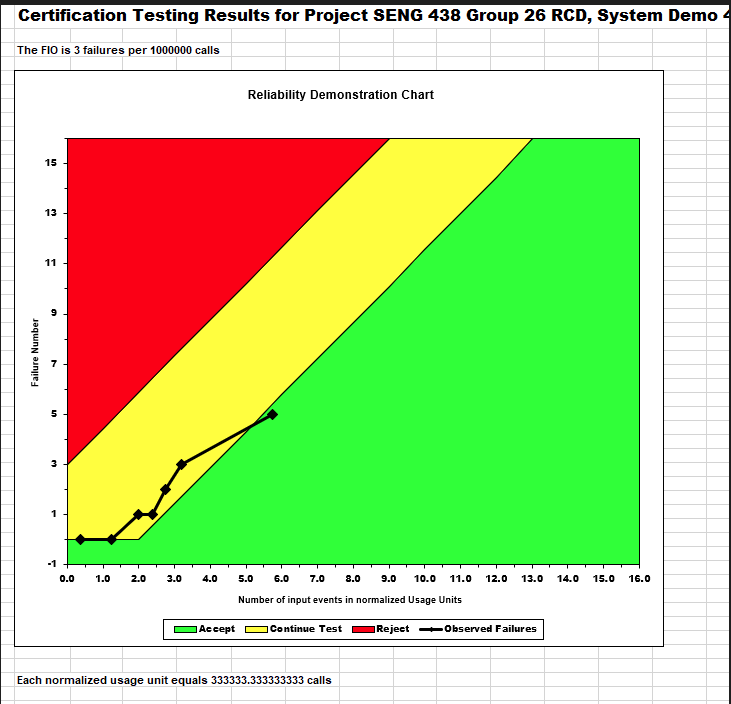
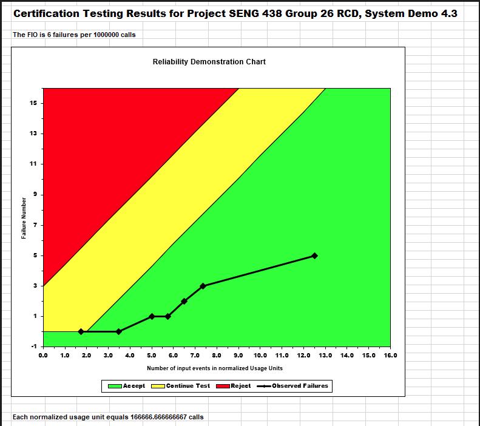
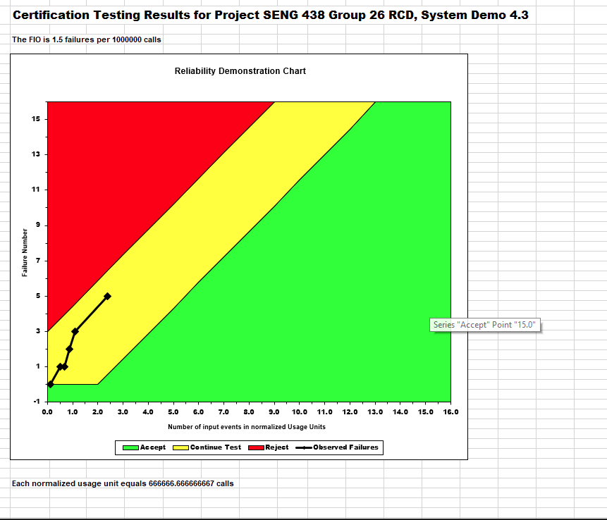

**SENG 438- Software Testing, Reliability, and Quality**

**Lab. Report \#5 – Software Reliability Assessment**

| Group \#:         |26 |
|-------------------|---|
|Dyson Davis        |   |
|Rodrigo Amesty     |   |
|Ernest Nikolaychuk |   |
|Truman Yen         |   |

# Introduction

The primary focus of this lab was to understand the reliability of
a system under test. The primary methods used were Reliability Growth Testing (RGT) and Reliability Demonstration Chart (RDC). We conducted
our analysis for the RGT models using C-SFRAT and used Excel to model
our RDC. We used a variety of metrics to understand the reliability of the System Under Test (SUT) such as failure intensity, failure rate, Mean time to failure (MTTF) and so on. This lab gave us a deeper knowledge of concepts learned in Chapters 8, 9 and 10. Ultimately, we were able to learn what makes a system reliable, which this report will cover in depth.

# 

# Assessment Using Reliability Growth Testing 
  In order to implement the Reliability Growth Testing models and predictions we first started by choosing a set of Test Data from 'failure-data-set2'. We decided upon Failure Report 3. To use C-SFRAT we then had had to convert the .docx file into a .xlsx file. The test data can be seen in the file 'Test Data'. We then input the data into C-SFRAT and retrieved the following charts:
  

After we had inspected the charts we began to do a range analysis to decide if we needed to use only a subset of the data or if all of it could be used. Based on the shape of the graphs and the relative linearity or the models we decided that we could use the entirety of the data for our reliability growth testing.

We then ran the model calculations and compared each model visually and by using the critic value field in the 'Model Comparison' tab of C-SFRAT.

We then found that the IFRGSB and NB2 models produced the most accurate prediction and chose them as our top 2 models. The models are shown below:

*NOTE* We could not use interval predictions as the graph would simply just break an example is shown below:

Next, we began to analyze the failure intensity graph to determine a Failure Intesity Target. Unfortunately we very quickly realized that our models all contain a positive ever increasing scope. This then meant that whatever Failure Intensity Target we implemented would only be surpassed after x amount of time. Similar to the predictions we could not even test this using C-SFRAT as we would have needed to input a value of over 20 and our computers were unable to provide the computation power needed to calculate the predictions. The general consensus of the data we used would then be that the project should be rejected as the rate of failure increases consistently as the project runs for a longer and longer amount of time.

Some of the advantages of Reliability Growth Testing would be:
1. RGT improves product reliability. RGT allows a development team to identify and resolve design flaws and defects before the product is released.
2. RGT reduces costs. RGT reduces costs as the cost of fixing a flaw or defect is much higher once a product is released versus fixing it before the product is released.

Some of the disadvantages of Reliability Growth Testing would then be:
1. RGT is Time-consuming. RGT can be a time-consuming process, requiring multiple testing cycles to identify and fix all the design flaws and defects.
2. RGT is Costly. RGT can be expensive, especially if multiple testing cycles are required or if the product requires significant design changes.
3. RGT may not be applicable to all products. RGT may not be necessary or applicable to all products, especially if the product has a short lifecycle or is not critical to the customer.
4. Risk of over-testing: There is a risk of over-testing, where the cost of testing exceeds the potential benefits of improving the product's reliability.

# Assessment Using Reliability Demonstration Chart 
The three graphs that we generated are below. We used Failure Report 3 from the Failure Data Set to generate these reports. The FIO or MTTF was selected on a basis of trial and error. We switched the values for the acceptable failures until the last point in the graph entered the accept zone. This turned out to be 3 failures per 1000000 calls.  

Looking at the following graphs, we see that doubling our FIO or halving our mttf makes out SUT enter the acceptance zone. This is because we are now allowing for more failures, and are more lenient in our acceptance. Halving our FIO or doubling our mttf makes us enter the continue testing zone. This is because we are now less lenient and demand less failures from our program. 

The advantages of RDC is that it is a simple way to analyze the reliablity of the SUT and come to a conclusion of our next steps. The disadvantages is that it cannot be used to calculate the exact value of reliablity or availability, and can only tell us if the SUT is acceptable or not. 
# 

# Comparison of Results

Both reliability growth testing and reliability Demonstration charts are good ways to find how dependable our system is. From the RGT plot we were able to compare failures to intervals of time. On the contrary, RDC was used to compare the reliability of the System under test by comparing input number to failures. These are two distinct methods of finding the reliability of a system, and can each give us unique insight. We found the failure rate of the RGT by finding the slope of the line of best fit for our plot, this gave us a failure rate of 0.33. For RDC, we found that the failure intensity  was 0.00003. Thus analyzing our RGT we found the system to not be reliable, as the failure rate was high. However, RDC was much more positive as it showed usage to failures, and resulted in a much lower number.Note that with more data we could conduct a more thorough analysis and better uderstand reliability of the system.

# Discussion on Similarity and Differences of the Two Techniques
- Both techniques utilize the same testing data, comparing failure time with failure number.  Both allow Software Reliability Engineers to determine the point at which a system has reached business goals for reliability.

- However, reliability growth testing provides projections for future failure rates, while reliability demonstration charts only address provided data, without making predictions.  In this sense, reliability growth testing is more useful for assessing the reliability of a system near the end of the development stage (when software reliability engineers are looking to predict the performance of a system later on in its life cycel), whereas reliability demonstration charts are useful during the development process (when engineers intend to determine if the system meets customer and developer requirements in its current state).
- Furthermore, reliability demonstration charts are a definitive measure of whether the system should be rejected or accepted in its current state, whereas reliability growth testing requires engineers to further interpret the graphical results (ie choosing the best statistical prediction model and selecting an appropriate target failure rate).
# How the team work/effort was divided and managed
- Dyson took the lead on setting up the C-SFRAT environment and aggregating provided testing data into an excel spreadsheet.
- Ernest conducted analysis on the Reliability Demonstration Chart,
- Rodrigo conducted analysis with Reliability Growth Testing,
- and Truman compared the differences between the two techniques.
# 

# Difficulties encountered, challenges overcome, and lessons learned
- Test data were written in numerous different tabular formats, requiring us to manually format them into a usable format
- SRTAT only runs on windows XP, requiring a virtual machine.  We overcame this challenge by instead using C-SFRAT, which was buggy on our machine at times, but completed the required tasks
- At the initial stages, it was challenging to understand and navigate the outdated RDC excel sheet provided
# Comments/feedback on the lab itself
- Much of the software provided was outdated and not forward compatible for modern machines
- We found a lack of documentation for much of the software, which made it difficult to set up and utilize the environment